<p align="center">
  
</p>

<p align="center">
  <a href="https://github.com/Facu-Basualdo"></a>&nbsp;
  <a href="https://www.linkedin.com/in/facundo-basualdo/"></a>&nbsp;
  <a href="mailto:tuemail@gmail.com"></a>&nbsp;
  
</p>

---

```ts
const facu = {
    location: "Argentina 🇦🇷",
    stack: ["Node.js", "Express", "Docker", "SQL", "TypeScript"],
    learning: "Architecture & Scalability 🚀",
    motto: "Always learning."
};
```

---

### 🛠 Tech Stack

<p align="center">
  
  
  
  
  
  
</p>

---

### 📌 Proyecto destacado

<a href="https://github.com/Facu-Basualdo/MiFacu">
  <picture>
    
  </picture>
  <strong>MiFacu</strong>
  <br/>
  <sub>Sistema educativo completo para gestión académica. Plataforma moderna pensada para mejorar la experiencia de estudiantes y docentes.</sub>
  <br/>
  <sub><code>TypeScript</code> <code>Node.js</code> <code>Express</code> <code>React</code></sub>
</a>

<br clear="left"/>

---

### 🐍 Contribuciones

<picture>
  <source media="(prefers-color-scheme: dark)" srcset="https://raw.githubusercontent.com/Facu-Basualdo/Facu-Basualdo/output/github-contribution-grid-snake-dark.svg" />
  <source media="(prefers-color-scheme: light)" srcset="https://raw.githubusercontent.com/Facu-Basualdo/Facu-Basualdo/output/github-contribution-grid-snake.svg" />
  
</picture>

---

<p align="center">
  <sub>Always learning. 🚀</sub>
</p>
